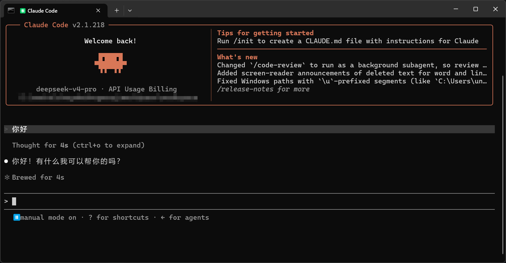
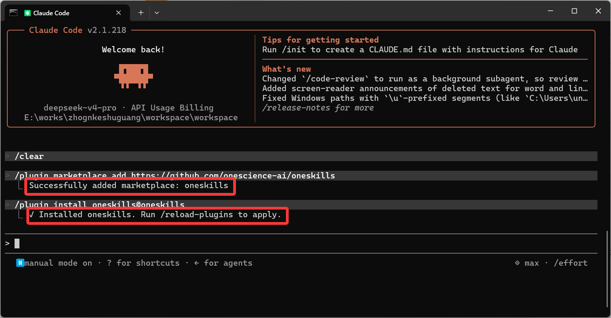


# **Claude Code 安装指南**

## 安装 Claude Code

### macOS

1. 安装或更新 [Node.js](https://nodejs.org/en/download/)（v18.0 或更高版本）。
2. 在终端中执行以下命令安装 Claude Code。

```
npm install -g @anthropic-ai/claude-code
```

3. 验证安装结果，输出版本号即表示安装成功。

```
claude --version
```

### Windows

在 Windows 上使用 Claude Code，需先安装 WSL 或 [Git for Windows](https://git-scm.com/install/windows)，然后在 WSL 或 Git Bash 中执行以下命令。

```
npm install -g @anthropic-ai/claude-code
```

> 详情参见 Claude Code 官方文档的 [Windows 安装教程](https://docs.anthropic.com/en/docs/claude-code/setup#windows-setup)。

## 跳过登录验证

编辑或新建 `~/.claude.json`（Windows 路径：`C:\Users\<用户名>\.claude.json`），将 `hasCompletedOnboarding` 设为 `true`，跳过 Anthropic 官方登录验证。

```
{
  "hasCompletedOnboarding": true
}
```

## 配置接入凭证

新建 `~/.claude/settings.json`（Windows 路径：`C:\Users\<用户名>\.claude\settings.json`），写入对应的配置。

```json
{
    "env": {
        "ANTHROPIC_AUTH_TOKEN": "YOUR_API_KEY",
        "ANTHROPIC_BASE_URL": "xxx",
        "ANTHROPIC_MODEL": "xxx"
    }
}
```

**安装完成界面如下所示：**



## OneSkills 安装

1. 在会话框中输入如下指令，将 OneSkills 添加到 Claude Code marketplace。

```shell
/plugin marketplace add https://github.com/onescience-ai/oneskills
```

2. 在会话框中输入如下指令，安装 `oneskills@oneskills` 插件。

```shell
/plugin install oneskills@oneskills
```

**当出现如下提示时表示安装完成：**


