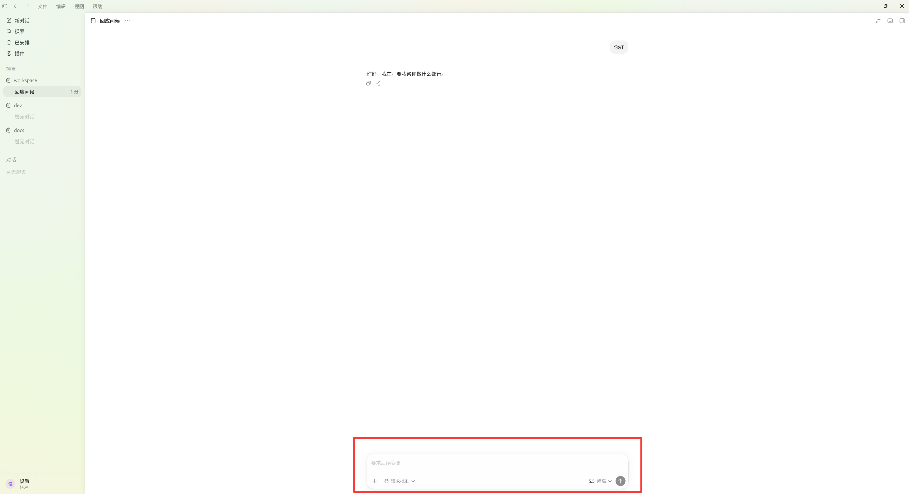
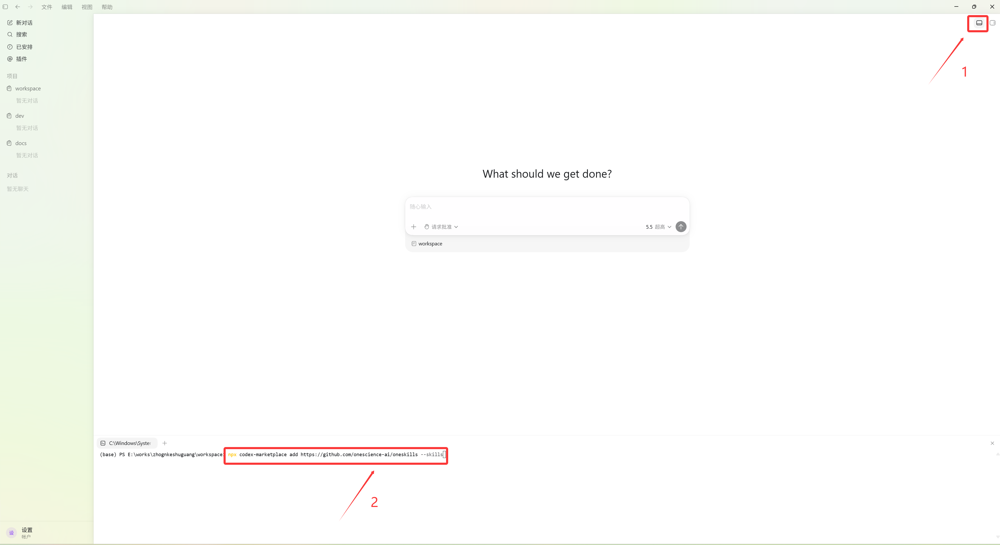
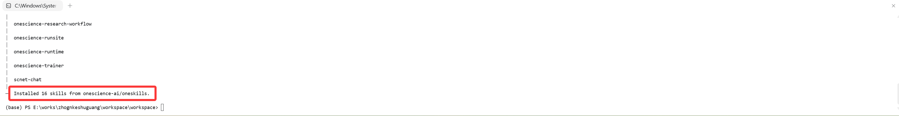


# **Codex 安装指南**

## **安装 Codex**

1.  安装或更新 [Node.js](https://nodejs.org/en/download/)（v18.0 或更高版本）。
    
2.  在终端中执行以下命令安装 Codex。

    ```
    npm install -g @openai/codex
    ```

    执行以下命令验证安装。

    ```
    codex --version
    ```

3. 配置接入凭证。

    接入需要编辑配置文件`~/.codex/config.toml`并配置环境变量`OPENAI_API_KEY`。

**安装完成界面如下所示：**



## OneSkills 安装

1. 打开 Codex，点击右上角"切换底部面板显示"按钮。
2. 在底部面板中输入如下命令，然后等待安装完成。

```shell
npx codex-marketplace add https://github.com/onescience-ai/oneskills --skills
```



**当出现如下提示时表示安装完成：**


