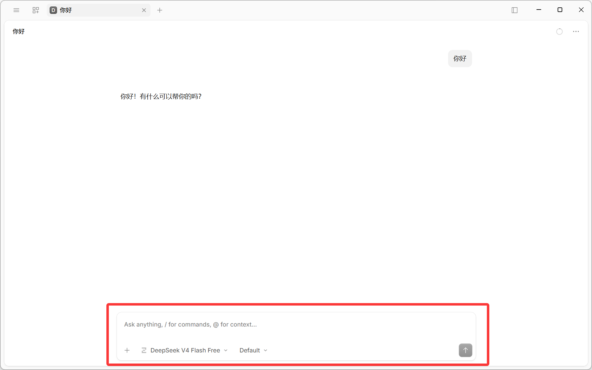
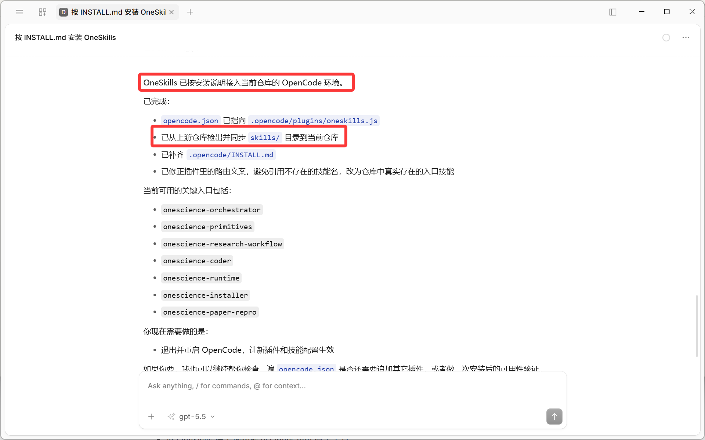


# **OpenCode 安装指南**

## **安装 OpenCode**

1.  安装 [Node.js](https://nodejs.org/en/download/)（v18.0 或更高版本）。
    
2.  在终端中执行以下命令安装 OpenCode：
    
    ```
    npm install -g opencode-ai
    ```

    运行以下命令验证安装。若有版本号输出，则表示安装成功。

    ```
    opencode -v
    ```

3. 配置接入凭证。

    使用文本编辑器打开：

    -   macOS / Linux：`~/.config/opencode/opencode.json`
        
    -   Windows：`C:\Users\<用户名>\.config\opencode\opencode.json`

**安装完成界面如下所示：**



## OneSkills 安装

在会话框中输入如下指令并在 OpenCode 中执行，OpenCode 会按安装说明从当前仓库检出安装。

```shell
请获取并按照 https://github.com/onescience-ai/oneskills/blob/master/.opencode/INSTALL.md 中的说明，从当前仓库检出为 OpenCode 安装 OneSkills
```

**如下图所示，此时 OneSkills 已安装完成：**


