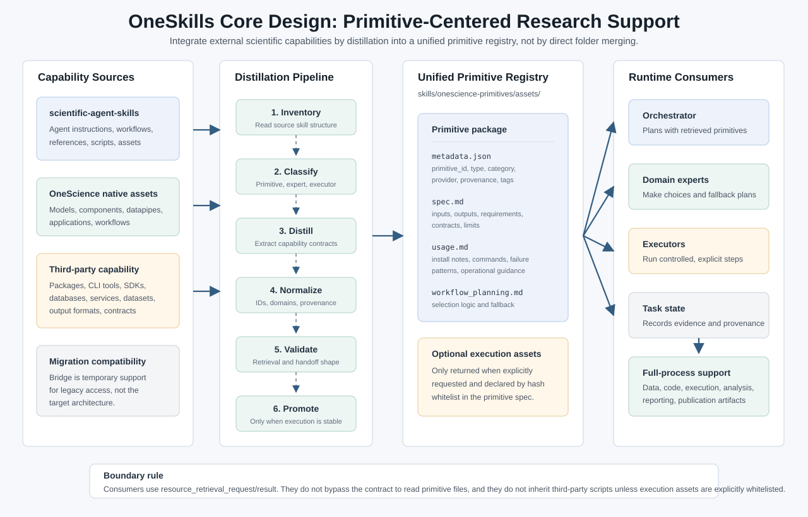

# OneSkills Primitive Unification Roadmap

本文档记录 `OneSkills` 下一步优化方向：将 `scientific-agent-skills` 中可复用的科研能力蒸馏进 `onescience-primitives`，形成面向全栈、全流程科研支持的统一原语体系。

## 核心设计图



## 1. 结论

当前目标不是把 `scientific-agent-skills/skills/` 直接合并到 `onescience-primitives/assets/`，而是做体系整合：

- `Agent Skill` 继续表示 agent 可选择、可执行的一组行为指令。
- `Primitive` 表示可被检索、绑定、规划或执行的科研能力单元。
- 第三方工具、数据库、服务、数据集、脚本模板、工作流经验、输出格式和校验契约，都可以成为 primitive。
- `onescience-primitives` 应作为统一 primitive registry，而不是只保存 OneScience 内部模型、组件和 datapipes。
- 所谓 bridge 只能是迁移期兼容层，不应成为目标架构。目标架构应把第三方能力吸收到 primitive schema 和 resource contract 中。

## 2. 为什么不能直接合并

`scientific-agent-skills` 和 `onescience-primitives/assets/` 的边界不同：

| 维度 | `scientific-agent-skills` | `onescience-primitives/assets/` |
| --- | --- | --- |
| 核心对象 | Agent 可加载的技能 | 系统可检索和绑定的原语资源 |
| 粒度 | 一项科学包、平台、数据库或工作流的 agent 操作手册 | 可规划、可调用、可组合的能力单元 |
| 主要消费者 | Agent 本身 | orchestrator、expert、executor |
| 生命周期 | 随上游包和 agent 指令更新 | 随 OneSkills 资源契约、运行时和任务状态演进 |
| 质量要求 | `SKILL.md` 触发、工作流、脚本、测试 | metadata、spec、usage、workflow_planning、可选 execution_assets |

直接复制会带来三个问题：

1. 语义重复：同一个工具既是可选 agent skill，又是 primitive 资源，触发边界会混乱。
2. 契约缺失：`SKILL.md` 里的长说明不能直接满足 `resource_retrieval_result` 的结构化返回。
3. 执行风险：`scientific-agent-skills` 的脚本环境、依赖和测试假设不能自动等价于 OneSkills executor 的运行契约。

正确做法是蒸馏：保留来源、提取能力、重写为 primitive schema，并在需要时再固化为 executor 或 expert。

## 3. Primitive 概念扩展

`Primitive` 应扩展为 OneSkills 内部的最小科研能力注册单元。建议覆盖以下类型：

- `model`: 模型、checkpoint、推理能力。
- `component`: 可组合模块、算子、模型子结构。
- `datapipe`: 数据加载、转换、预处理链路。
- `dataset`: 数据集、benchmark、标准样本集。
- `tool`: 第三方软件包、CLI、SDK、HPC 软件、实验室工具。
- `database`: 外部数据库、知识库、API 数据源。
- `service`: 云服务、平台服务、远程实验或计算接口。
- `application`: 面向任务的一组工具、模板和流程组合。
- `visualization`: 可视化规范、渲染器、报告呈现方式。
- `workflow-planning`: 可复用规划经验、决策树和 fallback。
- `contract`: 输入输出契约、校验规则、handoff schema。
- `output-format`: docx、pdf、pptx、表格、图件等交付格式。

第三方不是排除条件，而是 provenance 字段。是否能成为 primitive，取决于它是否能被描述、检索、绑定、规划和验证。

## 4. 推荐 Primitive Schema

最小目录结构继续沿用现有格式：

```text
skills/onescience-primitives/assets/<domain>/<category>/<primitive_name>/
  metadata.json
  spec.md
  usage.md
  workflow_planning.md
  scripts/                 # optional, only when declared in execution_assets
```

`metadata.json` 建议逐步补齐以下字段：

```json
{
  "name": "scanpy",
  "primitive_id": "bio.tools.scanpy",
  "type": "tool",
  "domain": "bio",
  "category": "tools",
  "version": "1.0.0",
  "provider_kind": "third_party_open_source",
  "provider_name": "scverse",
  "source": {
    "distilled_from": "scientific-agent-skills/skills/scanpy",
    "distillation_status": "resource_only",
    "copied_execution_assets": false
  },
  "description": "...",
  "tags": [],
  "capabilities": [],
  "requirements": [],
  "contracts": {
    "resource_output": "resource_retrieval_result"
  }
}
```

字段设计原则：

- `primitive_id` 用于稳定绑定，不依赖本地绝对路径。
- `type` 与目录 category 保持一致，允许 legacy 别名映射。
- `provider_kind` 描述来源，不决定层级。
- `source.distilled_from` 记录蒸馏来源，不表示运行时依赖原仓库。
- `execution_assets` 只有在经过白名单和 hash 校验后才可返回给 executor。

## 5. 从 `scientific-agent-skills` 蒸馏到 OneSkills

推荐流程：

1. Inventory：扫描 `scientific-agent-skills/skills/<name>/SKILL.md`、`references/`、`scripts/`、`assets/`。
2. Classify：判断该技能应进入 primitive、expert、executor，或拆分为多种对象。
3. Distill：
   - frontmatter `description` -> `metadata.description` 和 recall tags。
   - `When to use` / workflow -> `workflow_planning.md`。
   - API、依赖、输入输出 -> `spec.md`。
   - 安装、命令、常见失败 -> `usage.md`。
   - 脚本和模板 -> 可选 `execution_assets`，必须做 hash 白名单。
4. Normalize：统一 domain、category、primitive_id、provider、provenance 和限制说明。
5. Validate：用 resource retrieval 样例验证是否能被 orchestrator 检索、绑定，并被 expert/executor 消费。
6. Promote：只有当稳定执行边界明确时，才新增或扩展 `type=executor`；只有当需要动态取舍和 fallback 时，才新增或扩展 `type=expert`。

## 6. 对 OneSkills 的设计调整

下一步应修改 OneSkills 设计，而不是在外部长期桥接：

1. `onescience-primitives` 从 OneScience 内部资源库升级为统一 primitive registry。
2. `resource_retrieval_result.matched_resources[]` 保留现有字段，新增可选字段：
   - `primitive_id`
   - `category`
   - `provider`
   - `provenance`
   - `contracts`
   - `requirements`
3. `task_intent` 从固定枚举扩展为开放枚举，同时保留 legacy 值。
4. contribution guide 应允许第三方工具作为 primitive，并要求通过 schema 和 retrieval contract 接入。
5. orchestrator 不硬编码第三方工具逻辑，只消费 resource skill 返回的 primitive content。

## 7. 优先级路线

P0：契约修正

- 更新 README、贡献指南、resource contract 和 `onescience-primitives/SKILL.md`。
- 明确第三方工具可作为 primitive。
- 明确 bridge 只是迁移兼容，不是目标架构。
- 新增 `onescience-primitive-distiller`，把外部 agent skill / 第三方科研能力蒸馏为 primitive 资产包的流程固化为可触发 skill。

P1：小样本试点

- 从 `scientific-agent-skills` 选择 5-10 个代表性技能蒸馏为 primitives。
- 覆盖工具、数据库、数据集、可视化、工作流规划、输出格式。
- 每个样例只先做 resource 级蒸馏，不复制执行脚本。
- 当前已落地 `bio.tools.scanpy`，并由 `bio.application.bio_single_cell_analysis_app` 通过 `primitive_dependencies` 消费。
- 当前批量新增 `bio.components.anndata`、`bio.datasets.cellxgene_census`、`bio.tools.scvelo`、`bio.tools.scvi_tools`、`bio.tools.pydeseq2`，并接入单细胞应用卡。
- 当前新增 `general` domain，批量纳入实验设计、统计分析、科学可视化、公共数据库检索、Nextflow、文献综述和 Markdown/DOCX/PDF/PPTX 输出格式原语。
- 当前已落地 `onescience-primitive-distiller`，作为后续批量蒸馏的标准入口。

P2：批量蒸馏

- 建立 inventory 脚本，生成候选清单和分类建议。
- 批量生成 `metadata.json/spec.md/usage.md/workflow_planning.md` 草稿。
- 对高价值工具补充 execution asset 白名单。

P3：能力固化

- 将反复被调用、输入输出稳定的 primitives 提升为 executor。
- 将需要复杂取舍和 fallback 的领域经验提升为 expert。
- 建立 retrieval eval、handoff eval 和 task completion eval。

## 8. 验收标准

- 查询第三方工具时，`onescience-primitives` 能返回 `tool_primitive`。
- 返回结果中含稳定 `primitive_id`、provider、provenance 和限制说明。
- 上层只能消费 `matched_resources[*].content`，不能绕过 resource contract 直接读 assets。
- executor 不自动继承第三方 skill 的脚本，除非脚本已进入 `execution_assets` 白名单并通过 hash 校验。
- 新增 primitive 不要求修改 orchestrator 的领域硬编码。
