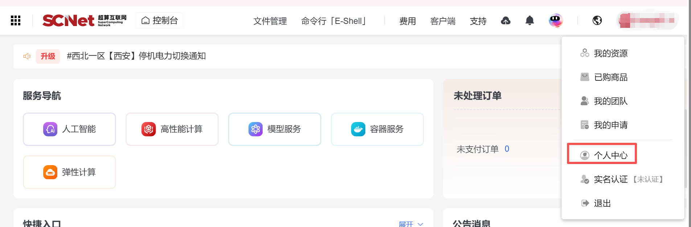
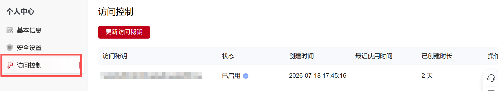

## 运行配置

### 支持的运行方式

OneSkills 支持以下运行模式：

| 运行方式 | 说明 |
| :--- | :--- |
| 本地直接运行 | 在当前机器直接执行任务 |
| 本地 Slurm 运行 | 在本地集群环境通过 Slurm 调度任务 |
| 远程 SSH 直接运行 | 通过 SSH 连接远程环境并执行任务 |
| 远程 SSH Slurm 运行 | 通过 SSH 登录远程集群，并使用 Slurm 调度任务 |
| SCnet 远程环境运行 | 通过 SCnet 接入远程计算环境执行任务 |

环境安装和任务运行过程中，OneSkills 会根据任务状态逐步引导用户提供必要信息，而不是要求用户一次性准备完整配置。

---

### 基础运行配置

用户可能需要提供以下字段：

| 字段 | 说明 |
| :--- | :--- |
| `run_site` | 运行站点。`local` 表示本地运行，`remote` 表示远程运行 |
| `execution_mode` | 调度方式。直接运行可为空，使用 Slurm 时填写 `slurm` |
| `access_mode` | 远程接入方式。远程运行填写 `ssh` 或 `scnet`，本地运行为空 |

---

### SSH 配置

使用 SSH 接入远程环境时，需要配置：

| 字段 | 说明 |
| :--- | :--- |
| `host` | SSH Host 别名；没有时可留空，由系统自动生成 |
| `hostname` | 远程主机名或 IP 地址 |
| `port` | SSH 端口，通常为 `22` |
| `user` | SSH 用户名 |
| `identity_file` | SSH 私钥路径 |
| `remote_work_dir` | 远程工作目录 |

---

### SCnet 配置

通过 SCnet 接入远程计算环境时，需要提供：

| 字段 | 说明 |
| :--- | :--- |
| `SCNET_ACCESS_KEY` | SCnet Access Key，不会在输出中明文回显 |
| `SCNET_SECRET_KEY` | SCnet Secret Key，不会在输出中明文回显 |
| `SCNET_USER` | SCnet 用户名 |
| `region` | SCnet 区域，例如核心节点、华东一区【昆山】等 |
| `remote_work_dir` | 远程工作目录 |

### SCnet 信息获取流程

登录超算互联网平台后，点击个人中心获取账户信息

然后点击“访问控制”，获取对应的访问控制信息

---

### Slurm 配置

当任务使用 Slurm 调度时，需要提供计算资源信息：

| 字段 | 说明 |
| :--- | :--- |
| `partition` | Slurm 分区名称，例如 `gpu`、`compute`、`hpctest01` |
| `nodes` | 节点数量，默认通常使用 `1` |
| `gpus_per_node` | 每节点 GPU/DCU 数量，默认通常使用 `1` |
| `cpus_per_task` | 每任务 CPU 核心数，默认通常使用 `8` |
| `memory` | 内存大小，例如 `64GB` |
| `time_limit` | 作业时间限制，格式为 `HH:MM:SS`，例如 `02:00:00` |
| `gpu_type` | Slurm 加速器类型，填写 `gpu` 或 `dcu` |
| `ntasks_per_node` | 每节点任务数，默认通常使用 `1` |
