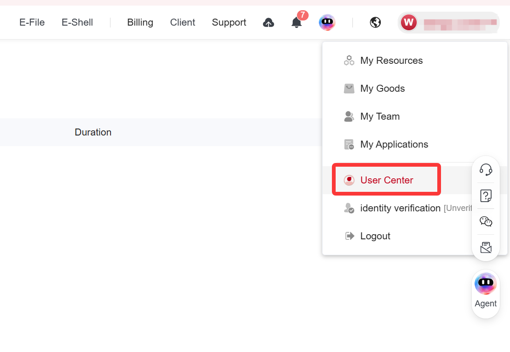
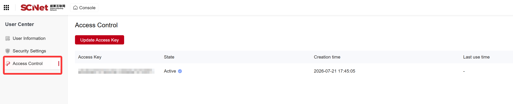

## Runtime Configuration

### Supported Runtime Modes

OneSkills supports the following runtime modes:

| Runtime Mode | Description |
| :--- | :--- |
| Local direct execution | Execute tasks directly on the current machine |
| Local Slurm execution | Schedule tasks via Slurm in the local cluster environment |
| Remote SSH direct execution | Connect to a remote environment via SSH and execute tasks |
| Remote SSH Slurm execution | Log into a remote cluster via SSH and schedule tasks with Slurm |
| SCnet remote execution | Access remote computing environments via SCnet |

During environment installation and task execution, OneSkills guides users to provide necessary information step by step, rather than requiring a complete configuration upfront.

---

### Basic Runtime Configuration

Users may need to provide the following fields:

| Field | Description |
| :--- | :--- |
| `run_site` | Runtime site. `local` for local execution, `remote` for remote execution |
| `execution_mode` | Scheduling mode. Leave empty for direct execution; use `slurm` for Slurm scheduling |
| `access_mode` | Remote access mode. Use `ssh` or `scnet` for remote execution; leave empty for local execution |

---

### SSH Configuration

When accessing a remote environment via SSH, the following configuration is required:

| Field | Description |
| :--- | :--- |
| `host` | SSH Host alias; can be left empty and auto-generated by the system |
| `hostname` | Remote hostname or IP address |
| `port` | SSH port, typically `22` |
| `user` | SSH username |
| `identity_file` | Path to SSH private key |
| `remote_work_dir` | Remote working directory |

---

### SCnet Configuration

When accessing a remote computing environment via SCnet, the following information is required:

| Field | Description |
| :--- | :--- |
| `SCNET_ACCESS_KEY` | SCnet Access Key (will not be displayed in plain text in output) |
| `SCNET_SECRET_KEY` | SCnet Secret Key (will not be displayed in plain text in output) |
| `SCNET_USER` | SCnet username |
| `region` | SCnet region, e.g., Core Node, East China Zone 1 (Kunshan), etc. |
| `remote_work_dir` | Remote working directory |

### SCnet Information Retrieval

After logging into the supercomputing platform, click on Personal Center to obtain account information, as shown below:

Then click "Access Control" to obtain the corresponding access control information, as shown below:

---

### Slurm Configuration

When using Slurm for task scheduling, the following compute resource information is required:

| Field | Description |
| :--- | :--- |
| `partition` | Slurm partition name, e.g., `gpu`, `compute`, `hpctest01` |
| `nodes` | Number of nodes; default is typically `1` |
| `gpus_per_node` | Number of GPUs/DCUs per node; default is typically `1` |
| `cpus_per_task` | Number of CPU cores per task; default is typically `8` |
| `memory` | Memory size, e.g., `64GB` |
| `time_limit` | Job time limit, format `HH:MM:SS`, e.g., `02:00:00` |
| `gpu_type` | Slurm accelerator type, use `gpu` or `dcu` |
| `ntasks_per_node` | Number of tasks per node; default is typically `1` |
