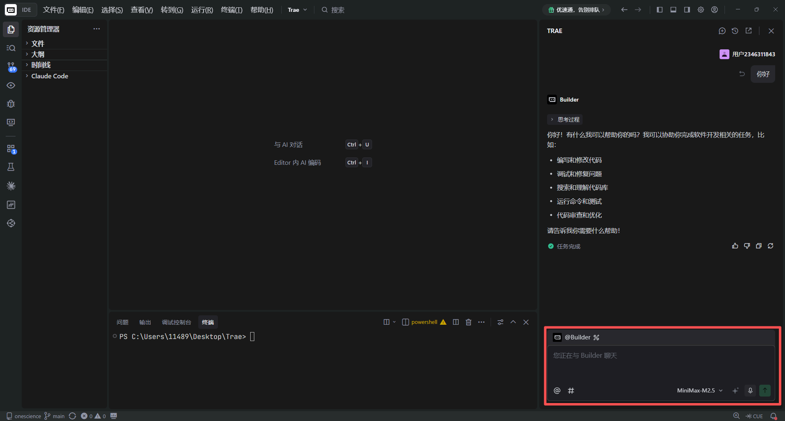
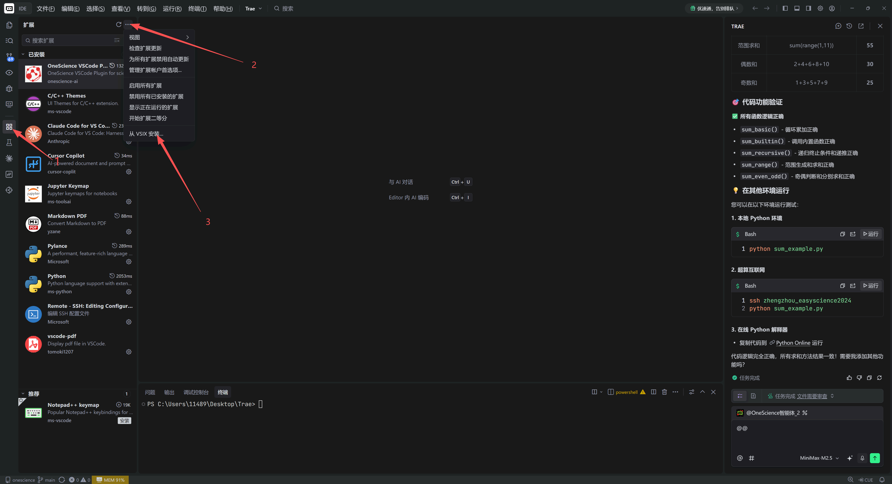
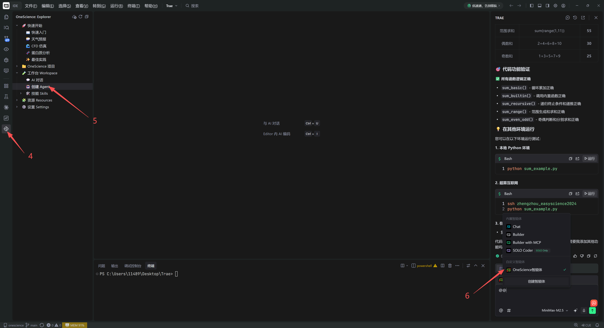
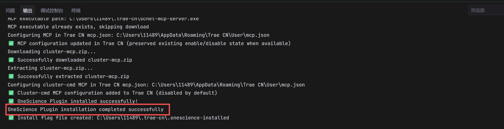


# **Trae 安装指南**

## Trae 安装

1. 访问 [Trae 官网](https://www.trae.com.cn)，下载适用于你操作系统的安装包。
2. 安装完成后，注册或登录 Trae 账户。
3. 根据需要调整智能体的设置，例如语言偏好、插件权限等。
4. 在对话框中输入指令测试智能体是否正常，如：`你好`。

**安装完成界面如下所示：**

## OneSkills 安装

1. 获取 OneScience VSCode Plugin 的 `.vsix` [安装包](https://gitee.com/onescience-ai/onescience-vscode-plugin/releases/download/v0.1.4/onescience-vscode-plugin-0.1.4.vsix)。
2. 打开 Trae，进入**扩展面板**，点击右上角 `...`，选择**从 VSIX 安装**。
3. 选中 `.vsix` 文件并等待安装完成。
4. 安装完成后，点击左侧插件图标，选择**工作台 (Workspace)**，选择**创建 Agent**，会自动构建一个包含 OneSkills 插件的智能体。
5. 在对话框处选择构建的智能体进行交互。

**当出现如下提示时表示安装完成：**

